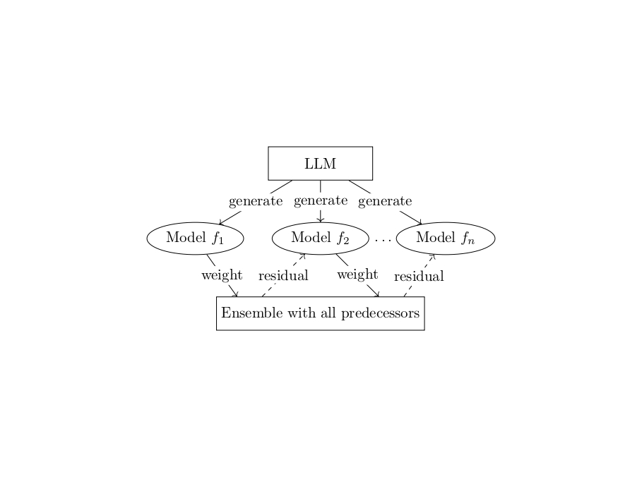

# Sections
- [AI for math](#ai-for-math)
- [AI for pure math problems](#machine-learning-for-predicting---gonality-of-modular-curves)

# AI for math

# Machine Learning for Predicting  $\mathbb{Q}$-Gonality of Modular Curves
In this work we study the $\mathbb{Q}$-gonality of modular curves.  For a congruence subgroup $\Gamma\subset\mathrm{SL}(2,\mathbb{Z})$ the associated modular curve is $X_\Gamma=\mathbb{H}/\Gamma$; when the action is free this is a hyperbolic Riemann surface.  The Q-gonality of $X_\Gamma$ is the minimal degree of a nonconstant rational map $X_\Gamma\to\mathbb{P}^1$ defined over $\mathbb{Q}$.  Computing $\mathbb{Q}$-gonalities is notoriously difficult.

**Conjecture**
$\mathbb{Q}$-gonality of \(X_\Gamma\) can be determined (uniquely) from a finite collection of arithmetic and geometric invariants: genus, number of cusps, Mordell–Weil rank, log-conductor, level, number of rational cusps, coarse class number, and coarse level.

While the conjecture remains open, we develop numerical evidence and a refined theoritical conjecture. The reason why numerical method can work in this conjecture is that mathematicians has built a dataset for existing modular curves: [the L-functions and Modular Forms Database (LMFDB)](https://www.lmfdb.org/knowledge/show/modcurve). It contains the desired dataset where the $\mathbb{Q}$-gonality is known and the dataset where the $\mathbb{Q}$-gonality only has a theoritical bound. Notably, the mathematical dataset is noise-free. Thus, it is obvious that we can use all sort of regression techniques to tackle this problem. In this direction, we used the some classical machine learning regression methods, XGBoost, FNN, FT-Transformer. As a results, they achieved $90\%$. For example, the FT-Transformer:

| Dataset | Acc. (%) | $R^2$ | RMSE |
| :--- | :--- | :--- | :--- |
| $D_{train}^{i}$ | $95.62 \pm 0.70$ | $0.9389 \pm 0.0325$ | $2.813 \pm 0.972$ |
| $D_{val}^{i}$ | $93.17 \pm 0.58$ | $0.9971 \pm 0.1079$ | $3.770 \pm 4.001$ |
| $D_{test}$ | $93.64 \pm 0.63$ | $0.9968 \pm 0.0007$ | $0.496 \pm 0.055$ |
| $D_{bounds}$ | $93.46 \pm 0.82$ | -- | -- |
*Table: Performance metrics for the FT-Transformer model across different datasets*

It is not suprising that the results are good. The drawback is obvious, these methods are so-called "black-box" model, meaning we have a overly complicated mathematical formula to represent the true relation (overfitted) while the true relation remains unknown. Also, its generalization is limited. The mathematicians cannot use this result to formulate any reasonable conjecture and therefore does not lead to its actual solution.

To recover the true relation and find an explicit formula, this job is often called *symbolic regression*. Classical method is to use [Genetic Algorithm](https://en.wikipedia.org/wiki/Genetic_algorithm), where in each generation it will spit out an addition symbol and filter the least fitted child. In this task, we not only care about the usual metrics of regression like [MSE](https://en.wikipedia.org/wiki/Mean_squared_error) and [$R^2$](https://en.wikipedia.org/wiki/Coefficient_of_determination) score, but also whether it hits the actual target (accuracy). It is a much harder task. For genetic type algorithms, like [PySR](https://github.com/MilesCranmer/PySR), the environment is too "cruel" for the "spices" and no "strong-enough" child can live, even though we guide the "spices" to evolve towards the direction of decreasing MSE. In the era of LLM, researchers have developed [LLMSR](https://github.com/deep-symbolic-mathematics/LLM-SR). Basically, this will feed all the information to LLM and let LLM to produce the actual relation. This may work for extremly simple tasks like simple [Newtonian physical motions](https://en.wikipedia.org/wiki/Newton%27s_laws_of_motion), if you believe that people has feed physics book to LLM. They actually built a [benchmark](https://arxiv.org/abs/2504.10415) and say it performed well. But for slightly complicated open problems, LLM often produces over-simplified formula, which performs poorly.

To address this problem, we introduce LLM-Boost, a hybrid method that combines large-language-model (LLM) based feature generation with [AdaBoost](https://en.wikipedia.org/wiki/AdaBoost). 

**Details (You may skip this if you don't mind)**: To recover an interpretable symbolic expression, we assume that the true functional relationship can be approximated by an additive model of the form

$$\tilde{f}(x) = \sum_{i=1}^k w_i f_i(x),$$

where each $f_i$ is a simple, non-linear feature function. These candidate features are generated by a pre-trained language model $\pi_\theta$, conditioned on dynamically updated prompts $p_i$, i.e., $f_i = \pi_\theta(\cdot \mid p_i)$. The prompts are adaptively modified to make sure no repeated feature is produced. To construct the ensemble of features, we adopt a boosting-inspired approach similar to AdaBoost. At each iteration $k$, we compute the residual of the current model $\tilde{f}_k = \sum_{i=1}^k w_i f_i$, and query the LLM to generate additional candidate features. These features are stored in a memory buffer. We then fit the residual using each feature in the buffer and select the one that yields the greatest improvement in predictive accuracy. This selected feature is incorporated into the model, and
the process is repeated.
This process is equivalent to linear regression on seleted features by Frisch-Waugh-Lovell Theorem if our initial factor model is linear regression model. However, this
viewpoint allows us to generalize further. Unlike standard regression models optimized purely for mean squared error, our final model prioritizes interpretability and accuracy, often resulting in lower bias and more meaningful symbolic expressions. The greedy selection strategy balances the exploitation of promising features with the exploration of novel ones, enabling efficient and interpretable symbolic discovery.

The key take-aways:
- LLM is not omnipotent, you have to let it evolve, starting from very simple tasks, similar to [AlphaEvolve](https://arxiv.org/abs/2506.13131).
- Orthogonalization makes every step "meaningful". We can explore new direction in the solution space at every step.
- Treat LLM as a "guessor", and record all the results that LLM may guess right and run a for loop.

LLM-Boost attains state-of-the-art performance among symbolic-regression approaches for this problem, and achieves the highest percentage of test cases fall within the theoretical bounds, improving on prior interpretable methods and matching the accuracy of black-box machine-learning baselines.

| Dataset | Accuracy | $R^2$ | RMSE |
| :--- | :---: | :---: | :---: |
| $D_{train}$ | 73.49% | 0.9973 | 0.5913 |
| $D_{val}$ | 72.91% | 0.9945 | 0.6718 |
| $D_{test}$ | 73.50% | 0.9895 | 1.9814 |
| $D_{bounds}$ | 81.52% | -- | -- |

*Table: Performance metrics for the LLM-Boost model across different datasets*

In particular, our final formula is extremly simple:

$$
\begin{aligned}
\text{Q-gonality} \; &=\; 0.113 \times \text{genus} \\
&-\; 0.347 \times \log(\text{level}+1) \\
&-\; 0.760 \times \bigl(\text{rational cusps} / (1 + \text{genus})\bigr) \\
&+\; 0.202 \times \exp(-\text{rank}) \\
&+\; 0.027 \times \text{log conductor} \\
&+\; 0.011 \times \bigl(\text{cusps} / (1 + \text{rank})\bigr) \\
&-\; 0.026 \times \sqrt{\text{coarse class num} + 1} \\
&+\; 0.003 \times \text{coarse level} \\
&+\; 2.834
\end{aligned}
$$

We believe that LLM-Boost can be applied to many other fields, for example, $\alpha$-mining and factor model optimization in quant finance.