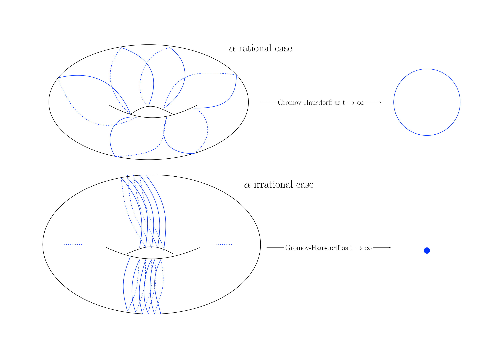

# Geometry Research Overall
Broadly speaking, my research interest focuses on understanding special metrics and their moduli spaces on manifolds, motivated by physics and topology. These metrics include [locally conformally flat](https://en.wikipedia.org/wiki/Conformally_flat_manifold) metrics, [Yamabe](https://en.wikipedia.org/wiki/Yamabe_problem) metrics, non-Kähler Hermitian metrics, and hyperbolic type metrics. The tools I use to understand these structures include conformal deformation, collapsing theory of Cheeger-Fukaya-Gromov, nonlinear PDE, and generalized curvature flows with surgeries. My coauthors and I have made progress on some well-known conjectures and discovered some interesting geometric phenomena. 

# Sections
- [The The Moduli space of locally conformally flat manifolds](#the-moduli-space-of-locally-conformally-flat-manifolds)
- [Generalized Curvature Flows](#generalized-curvature-flows)

# The Moduli space of locally conformally flat manifolds

## Sections
- [Introduction](#1-introduction)
- [Wang 2025](#2-on-the-structure-of-locally-conformally-flat-orbifolds-and-ale-metrics)
- [Viaclovsky-Wang 2026](#3-collapsing-yamabe-metrics-with-jeff-viaclovsky-in-preperation)
- [Future work](#4-future-work)

## 1: Introduction
My research concerns the moduli space of locally conformally flat ([LCF](https://en.wikipedia.org/wiki/Conformally_flat_manifold)) manifolds. LCF manifolds generalize two-dimensional conformal structures and arise as critical points of curvature functionals analogous to the Einstein condition. Their moduli space can be regarded as a higher-dimensional analogue of [Teichmüller space](https://en.wikipedia.org/wiki/Teichmüller_space). Concretely, we study
$\mathfrak{M}(n,\mu_0,C_0)$, the collection of closed n-dimensional Riemannian manifolds $(M,g)$ satisfying:
- locally conformally flat
- unit-scalar curvature: $R(g)\equiv 1$
- $g$ is the Yamabe metric with the Yamabe constant $Y(M,[g])> \mu_0 \geq0$
- $\int_M |\operatorname{Ric(g)|^{\frac{n}{2}}}dvol_g < C_0$

Let $\mathfrak{M}'(n, \mu_0, C_0)$ be the moduli space if we in addition assume that the manifolds are orientable.

Several of my works are made towards this direction, which will be explained next.

## 2: On the structure of locally conformally flat orbifolds and ALE metrics ([Wang 2025](https://arxiv.org/abs/2511.09857))

When $\mu_0>0$, [Tian-Viaclovsky](https://www.sciencedirect.com/science/article/pii/S0001870804002890?via%3Dihub) shows that any sequence in $\mathfrak{M}(n,\mu_0,C_0)$ subconverges to a Riemannian multi-fold — loosely, a finite collection of orbifolds that may be identified at a finite set of points. In particular, these limiting orbifolds have strictly positive orbifold Yamabe invariant. Moreover, [Tian-Viaclovsky](https://link.springer.com/article/10.1007/s00222-004-0412-1) proves that the blow-up models at singular points are scalar-flat ALE manifolds. 

To analyze these limits we establish the following structure theorem.

**Theorem (Wang 25)** We show:
- Let $(M,g)$ be an LCF orbifold with a positive orbifold Yamabe invariant, then $(M,g)$ is a good orbifold, i.e., it has a manifold cover;
- Let $(N,h)$ be an LCF ALE manifold with nonnegative scalar curvature, then for the $i$-th end, $E_i$, the inclusion map $i_k:E_k \to M$ induces an injective homomorphism ${i_k}_*:\Gamma_k\to\pi_1(M)$.
- $(M,g)$ and $(N,h)$ are related by conformal compactification and conformal blowing-up.

Moreover, in dimensions three and four, combining the previous classification results (Gromov-Lawson, ...), we obtain a complete classification of these orbifolds and ALE manifolds:

**Theorem (Wang 25)**
For $n=3,4$, then all LCF orbifolds with positive orbifold Yamabe invariant and LCF ALE manifolds with nonnegative scalar curvature are classified (as conformal connected sums of prime building blocks). 

We also have the moduli space application.

**Theorem (Wang 25)** Let $(M_i, g_i)$ be a sequence in  $\mathfrak{M}'(n, \mu_0, C_0)$.
- If $n=3$, then the Gromov-Hausdorff limit is finitely many LCF manifolds with finitely many points identified.
- If $n=4$, then the Gromov-Hausdorff limit is finitely many LCF orbifolds with finitely many points identified, such that the tangent cone at any singular point has an even number of cones with non-trivial orbifold groups, which appear in pairs.

**Corollary (Wang, 25)** The football metric $\mathbb{S}^4/\Gamma$ cannot be realized as the Gromov-Hausdorff limit for any sequence of closed, orientable, LCF manifolds $(M^4_i,g_i)\in\mathfrak{M}'(4,\mu_0,C_0)$.

This result is significant because ruling out potential Gromov–Hausdorff limits is, in general, delicate. A related statement in the Einstein setting appears in [Ozuch](https://msp.org/gt/2022/26-4/gt-v26-n4-p03-p.pdf), although the methods employed there are different from ours.

We also establish a [positive mass theorem](https://en.wikipedia.org/wiki/Positive_energy_theorem) for these ALE orbifolds and identify the optimal decay rate in the scalar‑flat case. The result is remarkable since a positive mass conclusion for ALE manifolds does not hold in full generality. Counterexamples constructed by [LeBrun](https://link.springer.com/article/10.1007/BF01221110).

**Theorem (Wang, 25)** Let $(M,g)$ be an LCF, nonnegative scalar curvature, ALE orbifold, then the ADM mass is nonnegative for any end of $(M,g)$. The mass is zero at an end if and only if $(M,g)\cong (\mathbb{R}^n,g_{\mathbb{R}^n})/\Gamma$, where $\Gamma\subseteq {\rm{O}}(n)$ is a finite subgroup that acts isometrically and fixes the origin.
    Furthermore, if $(M,g)$ is scalar-flat, then $(M,g)$ is ALE of order $n-2$, which is optimal. 

As a consequence, the orbifold Yamabe problem is proved using Schoen's test function.

**Corollary (Wang, 25)**
If $(M^n,g)$ is an LCF compact orbifold with positive scalar curvature, 
then there exists a solution $\tilde{g} = u^\frac{4}{n-2} g$ to the orbifold Yamabe problem on $(M,g)$. 

The result is interesting because the orbifold Yamabe problem is not solvable in full generality. [Viaclovsky](https://aif.centre-mersenne.org/articles/10.5802/aif.2617/) exhibits a counterexample.
## 3: Collapsing Yamabe metrics (With Jeff Viaclovsky, In preperation)
If we set $\mu_0=0$, so that we only assume the Yamabe invariant satisfies $Y(M,[g])>0$, we denote the corresponding moduli space by $\mathfrak{M}(n,0^+,C_0)$. In this regime genuine degenerations can occur. In the sequel we study collapsing phenomena for sequences of Yamabe metrics; the metrics need not be locally conformally flat, only of constant scalar curvature. We develop some new degeneration examples which is not known in other area. Many of the statements below extend to nonpositive Yamabe classes, but for brevity we state here the positive‑Yamabe results.

**Definition** 
We call a sequence of n-dimensional closed Riemannian manifolds $\{(M^n_i,g_i)\}$ *$S(n,d,C,D,\delta)$-spectral admissible* if
- $|\operatorname{Rm}(g_i)|_{g_i}\leq C_1$;
- $\operatorname{diam}(M^n_i,g_i)\leq D$;
- The scalar curvature $R(g_i)\equiv1$;
- Let $\mu_i = \frac{d\operatorname{vol}(g_i)}{\operatorname{vol(M^n_i,g_i)}}$. The sequence converges to a d-dimensional manifold in the measured Gromov-Hausdorff sense, i.e.:
$$(M^n_i,g_i,\mu_i)\to (X^d, g_\infty,\mu_\infty)$$
- There exists a $\delta>0$ such that the Bakry-Émery Laplacian $\Delta_\mu$ associate with $\mu$ does not have eigenvalues in $[\frac{1}{n-1}-\delta,\frac{1}{n-1}+\delta]$.

First, we solve the following [Cheeger-Fukaya-Gromov](https://www.ihes.fr/~gromov/wp-content/uploads/2018/08/384.pdf) conjecture in the constant scalar curvature case:

**Theorem (Via-W, 26)**
Let $\{M_i^n, g_i)\}$ be a $S(n,d,C,D,\delta)$-spectral admissible sequence. 
Then, for $i$ large, there exists $g'_i$ such that:
- $g_i$, $g_i'$ are close in the $C^\infty$ sense, with $|g_i-g_i'|_{C^\infty}\to 0$;
- $g_i'$ is $\mathcal{N}$-invariant;
- $R(g_i') \equiv 1$;
- $(M_i, g_i')\to (X, g_\infty)$ in the Gromov-Hausdorff sense.

Next, we present a gluing construction of collapsing constant‑scalar‑curvature metrics, in the spirit of [D.Joyce](https://onlinelibrary.wiley.com/doi/10.1155/S016117120310806X). The novelty is that one or both pieces are allowed to collapse while keeping the constant scalar curvature unchanged. More precisely, we prove the following:

**Theorem (Via-W, 26)**
Let $\{(M_i,g_i)\}$ be a $S(n,d,C,D,\delta)$-spectural admissible sequence, $\{N_i,h_i)\}$ be a $S(n,k,C,D,\delta)$-spectural admissible sequence, with corresponding limits as $i\to\infty$, $(X^d, g_\infty)$, $(Y^k,h_\infty)$, with $d,k\geq 3$. Then, for $i$-sufficiently large, there will be a sequence of metrics $(M_i\#N_i, \hat{g}_i)$, such that:
- The scalar curvature $R(\hat{g}_i)\equiv 1$;
- The sequence converges to $(X\wedge Y, l)$ in the Gromov-Hausdorff sense, where $l_{|X} = g_\infty$ and $l_{|Y} = h_\infty$.

This yields the first example of degeneration to the wedge sum of two manifolds of different dimensions while preserving the constant-scalar-curvature condition. The degeneration described above can indeed occur in the moduli space $\mathfrak{M}(n,0^+,C_0)$. Unlike the Einstein setting, the Ricci curvature need not be uniformly bounded from below: in our construction the blow-down of the neck region has Ricci curvature tending to $-\infty$. Note that the curvature blow-up in this construction occurs only at isolated points.
## 4: Future work
We aim to compactify the moduli space $\mathfrak{M}(n,0^+,C_0)$ and to fully describe the degeneration behavior as metrics approach the boundary of the moduli space. A central analytic input is an $\varepsilon$-regularity statement for LCF manifolds assuming only a positive Yamabe invariant.

**Conjecture** 
There exist universal constants $C$ and $\varepsilon_0>0$ with the following property. If $(M,g)\in\mathfrak{M}(n,0^+,C_0)$ and for some geodesic ball $B_r$ one has
$$\int_{B_r}|\operatorname{Ric}|^{\tfrac{n}{2}}\,dv < \varepsilon_0,$$
then the pointwise bound
$$\sup_{B_{r/2}}|\operatorname{Ric}|
        \le \frac{C}{r^2}\Big(\int_{B_r}|\operatorname{Ric}|^{\tfrac{n}{2}}\,dv\Big)^{\tfrac{2}{n}}$$
holds.

When a uniform positive lower bound $\mu_0>0$ on the Yamabe invariant is assumed, an $\varepsilon$-regularity statement of this type follows from Moser iteration techniques. The conjecture is known to fail in the zero Yamabe constant or $n\geq 5$ regime.

If the above conjecture is established, curvature concentration can occur only at finitely many points, and one expects that the collapsing and gluing phenomena constructed capture the worst-case degenerations in the boundary of $\mathfrak{M}(n,0^+,C_0)$.
# Generalized Curvature Flows

## Sections
- [Pluriclosed flow](#2-pluriclosed-flow-on-oeljeklaus--toma-manifolds-with-jeff-d-streets-streets-wang-2025)
- [$\alpha$-Ricci flow general theory](#3--ricci-flow-analytic-aspects-with-a-cusenza-y-guo-k-lee-m-womack-in-preperation)
- [$\alpha$-Ricci flow on torus](#4--ricci-flow-on-torus-with-yifan-guo-in-preperation)
- [Future work](#5-future-work)
## 1: Introduction
Another strand of my research uses generalized curvature flows to address geometric and topological problems. Analogous to Ricci flow, these flows evolve a metric according to curvature and related geometric quantities. In the non-Kähler setting we study the long-time behaviour of the pluriclosed flow on Oeljeklaus--Toma (OT) manifolds, resolving several conjectures motivated by model solutions. For hyperbolic geometry we introduce a new curvature flow, develop the analytic toolkit required for existence, regularity, and surgery, and apply it to topological questions in hyperbolic 3‑manifolds in the spirit of the Geometrization program.
## 2: Pluriclosed flow on Oeljeklaus--Toma manifolds (with Jeff D. Streets [Streets-Wang 2025](https://arxiv.org/abs/2512.11246)) 

The [Inoue surfaces](https://en.wikipedia.org/wiki/Inoue_surface) of type $S^0$ provide fundamental examples of compact complex surfaces in Kodaira class VII that are non‑Kähler. Oeljeklaus--Toma (OT) manifolds are higher‑dimensional analogues constructed from number‑theoretic data. We study non‑Kähler Hermitian metrics on these spaces via the pluriclosed flow. A conjecture of the long time behavior is the following:
**Conjecture** 
Let $\omega_0$ be any pluriclosed metric on the OT manifold of type $(s,s)$, then it has long-time existence and the blow-down limit $\frac{\omega(t)}{t}$ will collapse to $(\mathbb{T}^s,d_s)$, real torus of real $s$ dimension with some flat metric $d_s$, in the Gromov-Hausdorff sense.

Our first result confirms the first part of the conjecture.

**Theorem (Str-W, 25)** 
Let $\omega_0$ be any pluriclosed metric on the OT manifold of type $(s,s)$, then, the pluriclosed flow $\omega(t)$ starting with $\omega_0$ will exist on $[0,\infty)$.

We are primarily interested in the blow‑down limit. Motivated by the Type III asymptotics of the Ricci flow, we therefore study the normalized pluriclosed flow. On OT manifolds the generalized Kähler structure introduced by Hitchin and Gualtieri is natural and widespread; with respect to this structure the long‑time behavior of the flow is governed by a fully nonlinear complex Monge–Ampère type PDE. See [Streets](https://arxiv.org/abs/1405.0727).
$$\frac{\partial}{\partial t}f(t)+f(t)=\operatorname{log}\frac{\operatorname{det}g_\mathbb{C}(t)}{\operatorname{det}h_\mathbb{C}(t)}-\operatorname{log}\frac{\operatorname{det}g_\mathbb{H}(t)}{\operatorname{det}h_\mathbb{H}(t)}.$$

Note that the nonconvexity of this Monge--Ampère-type equation makes estimates extremely challenging. With this in mind, we establish the following result, which partially resolves the second part of the conjecture for the Inoue surface.

**Theorem (Str-W, 25)**
The scalar potential $f$ will satisfy the following estimate in $[0,\infty)$:
- $-C_0\leq f(t) \leq C_0 e^{-t}(1+C_1t)$,
- $-C_1\leq \frac{\partial f}{\partial t}\leq C_2$.

In particular, when $s =1$, on the Inoue surface, $S^0$:
- $-C_0e^{-t}(1+C_1t)\leq f(t) \leq C_0 e^{-t}(1+C_1t)$,
- The metric: $\operatorname{tr}_{\omega_h(t)}\omega(t)\geq \delta>0$.

Unlike the Chern--Ricci flow, where estimates for the complex Monge--Ampère equation often yield full metric equivalence between the model metric and the evolving metric, here we obtain only a uniform lower bound for the evolving metric with respect to the model metric $\omega_h(t)$. Establishing the corresponding uniform upper bound will be addressed in future work.
## 3: $\alpha$-Ricci flow analytic aspects (With A. Cusenza, Y. Guo, K. Lee, M. Womack, In preperation)
In this work we introduce a family of generalized curvature flows, which we call the $\alpha$-Ricci flow. Our aim is to apply this flow to the geometry and topology of compact hyperbolic $3$-manifolds: to uncover new geometric structures and to construct finite-dimensional moduli spaces of hyperbolic-type metrics analogous to Teichmüller space.

**Definition** Given a smooth manifold $M^n$, we say that a one-parameter family $(g_t,\alpha_t)$ of pairs of Riemannian metrics and closed one forms is a solution of *$\alpha$-Ricci flow* if it satisfies
$$\left\{\begin{aligned}
	\frac{\partial }{\partial t}g=&-2\operatorname{Ric}+\tfrac{1}{2}\alpha\otimes\alpha\\
	\frac{\partial }{\partial t}\alpha=&-dd^*_g\alpha
\end{aligned}\right.$$

We first develop the analytic framework in close analogy with the Ricci flow. In addition to the standard PDE results — short‑time existence, smoothing estimates, and continuation criteria — the flow enjoys several structural properties that are crucial for the global analysis. These properties are collected in the following theorem.

**Theorem (CGLWW, 25)**
Let $(M,g(t),\alpha(t))$ be a solution of $\alpha$-Ricci flow on $[0,T)$. Then:
- A prior $|\alpha|$ boundedness: $\sup_{M\times\{t\}} |\alpha|^2\leq ((\sup_{M\times\{0\}}|\alpha|^2)^{-1}+\frac{t}{2})^{-1}$;
- The $\alpha$-scalar curvature $R^\alpha = R-\frac{1}{4}|\alpha|^2$:
$$\square R^\alpha = 2|\operatorname{Ric}-\frac{1}{4}\alpha\otimes\alpha|^2 + \frac{1}{2}|d_g^*\alpha|^2\geq\frac{2}{n}(R^\alpha)^2.$$

With the help of the above, we establish the following: $\mathcal{F}^\alpha$ functional, $\mathcal{W}^\alpha$ functional, reduced length and reduced volume, and no-local collapsing theorem. The upshots are the following Pseduolocality theorem and canonical neighborhood theorem. Since the statement of these theorems are like the case in the Ricci flow and are known to the experts, I will just sketch the statements. 

**Theorem (CGLWW, 25)**
On a complete $\alpha$-Ricci flow solution. For a ball at the scale of lower bound of $\alpha$-scalar curvature $R^\alpha$, if the isoperimetric constant is sufficient close to the Euclidean one, then the curvature will smooth out.

**Theorem (CGLWW, 25)**
On a complete 3-D $\alpha$-Ricci flow. Then the "high curvature region" is close to either a quotient of shrinking sphere, a quotient of shrinking "neck", or a shrinking "cap".

Building on the above, we implement an $\alpha$-Ricci flow with [surgery](https://en.wikipedia.org/wiki/Poincaré_conjecture#Ricci_flow_with_surgery) and plan to apply this surgical flow to geometric and topological problems.
## 4: $\alpha$-Ricci flow on torus (With Yifan Guo, In preperation)
We now apply $\alpha$-Ricci flow to two-dimensional manifolds. The sphere ($g=0$) case is treated in [Lott-Sesum](https://ems.press/journals/cmh/articles/12457), and the higher‑genus case ($g\geq 2$) will be discussed in the next section. Here we concentrate on the torus ($g=1$). In this setting the flow exhibits a novel instability in its long‑time behavior.

First, we derive uniform estimates for the geometric quantities that follow. The arguments use the Gauss--Bonnet theorem in an essential way, and hence are specific to two dimensions. The conclusions are summarized in the theorem below.

**Theorem (Guo-W, 25)**
Let $(M,g(t),\alpha(t))$ be a solution of $\alpha$-Ricci flow on the 2-torus with arbitrary initial data. Then:
- The flow exists on $[0,\infty)$;
- The volume $V(t)$: $V(0)\le V(t) \le V(0)\sqrt{1+\frac{t}{2C}}$;
- Type III estimate: $|R(x,t)|\le \frac{C}{1+t}$;
- Diameter estimate: $\operatorname{diam}(M,g(t)) \le C(\sqrt{t}+1)$.

Despite many formal similarities between the Ricci flow and $\alpha$-Ricci flow, their long-time behavior differs markedly. On the 2-torus we prove the following result describing the Gromov–Hausdorff limit of solutions to $\alpha$-Ricci flow: the limit depends discontinuously on the initial data.

We choose a set of generators $[\gamma_1],[\gamma_2]$ of $\pi_1(M)\cong\mathbb{Z}\times\mathbb{Z}$ and define $a=\int _{\gamma_1}\alpha$, $b=\int_{\gamma_2}\alpha$. Since $\alpha$ evolves by an exact form, both $a$ and $b$ are invariant under the flow.

**Theorem (Guo-W, 25)**
et $(g(t),\alpha(t))$ be a solution to the $\alpha$-Ricci flow on $\mathbb{T}^2$. Then we have the following.
- If $\frac{a}{b}\in \mathbb{Q}\cup \{\infty\}$, then $(M,\frac{g(t)}{t})$ converges to $(S^1,d_{a,b})$
		in the Gromov-Hausdorff topology, where $d_{a,b}$ is the Riemannian metric on $S^1$ of length $\ell_{a,b}$, some constant purely determined by $\frac{a}{b}$.
- If $\frac{a}{b}\in \mathbb{R}\setminus\mathbb{Q}$ or $a=b=0$, then  $(M,\frac{g(t)}{t})$ converges to a point in the Gromov-Hausdorff topology.

This is illustrated as the following:

## 5: Future work

We wish to apply $\alpha$-Ricci flow to [hyperbolic manifolds](https://en.wikipedia.org/wiki/Hyperbolic_manifold) in dimensions 2 and 3. In dimension 2, some partial results are made, where if $[\alpha]\neq0$, there will be cusps in the limit, and the thick part converges to the hyperbolic metric. In dimension 3, we may use the $\alpha$-Ricci flow with surgery to prove the following conjecture:

**Conjecture**
Let $M = \mathbb{H}^3/\Gamma$ be a compact hyperbolic 3-manifold, where $\Gamma\subset \operatorname{Isom}(\mathbb{H}^3)$ is a cocompact subgroup. Then, for any $[\alpha]\in H^1(M)$, there exists an unique metric $g_\alpha$ such that, and a representative $\alpha$, such that:
$$\left\{\begin{aligned}
	&\operatorname{Ric}-\tfrac{1}{4}\alpha\otimes\alpha=-g\\
	&d^*_g\alpha=0.
    \end{aligned}
    \right.$$

If the above conjecture is shown true, then the moduli space of $\alpha$-Einstein metrics of dimension $H^1(M)$ is built, which gives us extra flexibility despite the Mostow rigidity. It will be very interesting to understand such moduli space, especially when it approaches to the boundary.