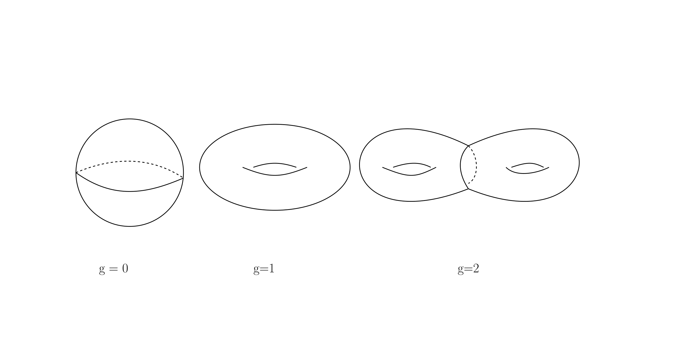
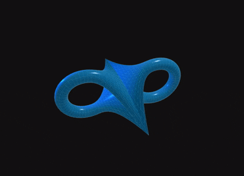
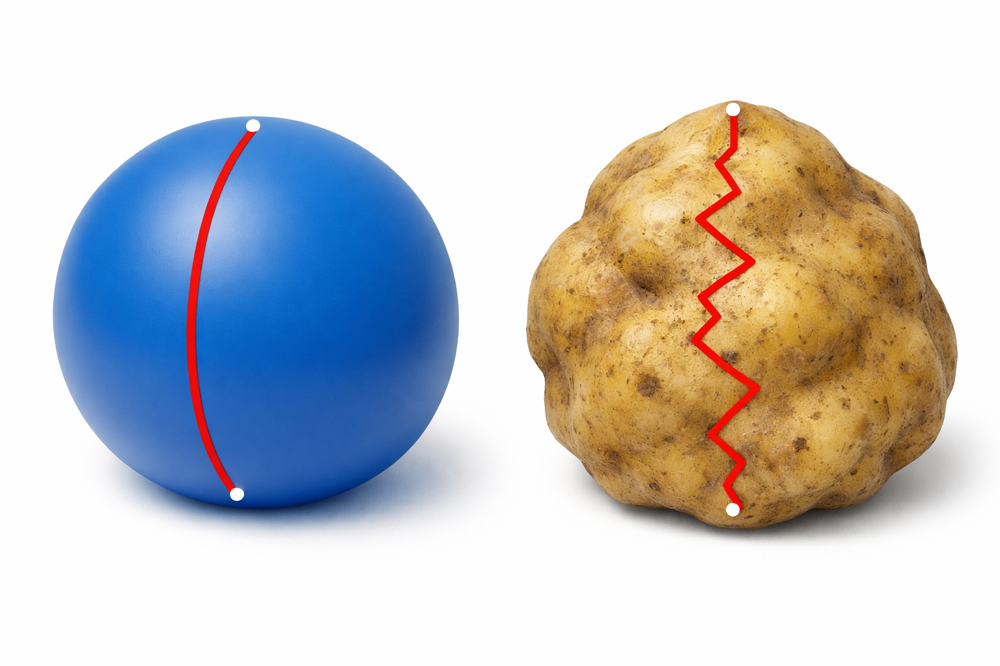
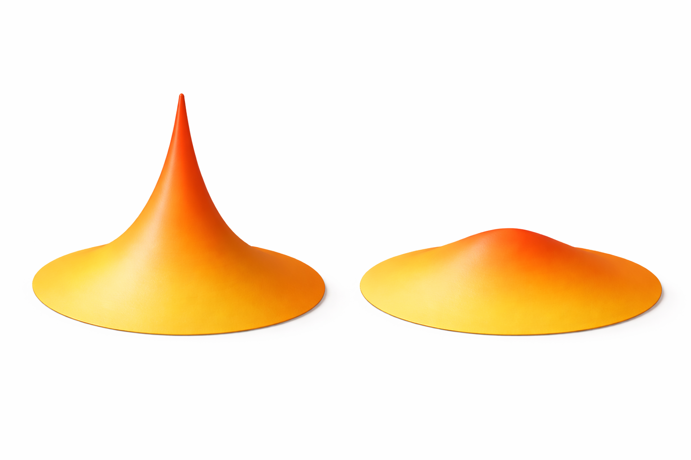
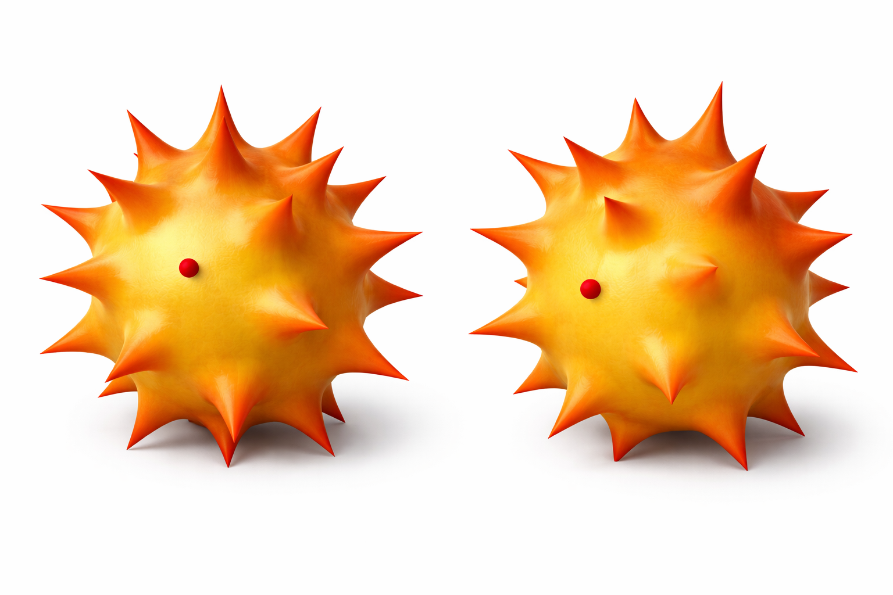

# Description

**Definition**: a *Manifold* is space that around each point it "likes" Euclidean space.

# Contents
- [Geometry and Topology](#geometry-and-topology)
- [Metric Equivalence](#metric-equivalence)
- [Moduli space of metrics](#moduli-space-of-metrics)
- [Study of Moduli space: Sequential Limit](#study-of-moduli-space-sequential-limit)
- [Study of Moduli space: Flow Method](#study-of-moduli-space-flow-method)

# Geometry and Topology
I will introduce two concepts first: Geometry and Topology

Let's fix our discussion on 2 dimension surfaces for now. In dimension one, there is actually no geometry. All of the "closed" 1 dimensional curves are just loops, they are "equivalent" geometrically and topologically. In dimension 2, we call a 2 dimensional manifold a *surface*. Below are some examples of surfaces.

## What is Topology?
*Topology* is the study of shape in a very relaxed sense. Two objects are topologically the same if you can turn one into the other using only those allowed moves. Topology ignores exact sizes and distances.
It only cares about *connectivity* and *holes*.

Imagine objects made of perfectly stretchy rubber:
- You are allowed to stretch, bend, twist, and squish
- You are not allowed to:
- tear the object
- glue parts together
- punch new holes

Try <a href="surface_deformation.html"><button type="button">Surface Deformation</button></a> yourself! 

You may have a cool observation: 
- If two (closed) surfaces are topologically equivalent if they have the same number of "holes".

This is absolutely correct. In dimension 2, the reverse direction is also correct:
- If two (closed) surfaces have the same number of "holes", then they are topologically equivalent.

So the number of holes is a permanent fingerprint. Mathematically, this is called [Genus](https://en.wikipedia.org/wiki/Genus_(mathematics)), which is the simplest *topological invariant*. 

You may see the topology in this case is "discrete" in nature (Genus can only be positive integers instead of real number).

## What is Geometry?
If we view topology property is something which is "soft", then *Geometry* is the "hard" contrary. For topological property, we ignore "wrinkles", "bumps" and other weird distortions. But for geometric property, we care.
The simplest "hard" object on surfaces is *distance* of two points.

How can we define the distance on a surface? Recall on Euclidean space, we have: 
- Among curves connecting two points, the straight line is the shortest.

Thus the distance between two points are defined to be the length of the straight line segment connecting two points. 

On surfaces, we use similar definition:
- The distance between two points is the minimal length among all curves connecting these two points.

Now, we are ready to see an example distinguishes geometry and topology:

Take the picture for example. A "sphere" is topologically equivalent to a "potato", since there is no hole at all. But the disance between the "north pole" and "south pole" are not the same. Thus, distance is not a topological property, it tides with the shape.

We see different "shape" admits different distance between points. We shall call the "shape" as [metric](https://en.wikipedia.org/wiki/Riemannian_manifold), as it determines distance. We can say in the <a href="surface_deformation.html"><button type="button">Surface Deformation</button></a> you produce a lot of different metrics on the same surface.

You may see the geometry is "continuous" in nature (We can continuously deform a surface without changing its topology). 

# Metric Equivalence
As a differential geometor, I am more interested in metrics. We see that a surface can admit a lot metrics. Here is a big problem:
- How can we distinguish two metrics?

This question is hard. I will answer this question in two steps.

## Metric Local Equivalence: Curvature
We can first formulate it locally. What I mean is
- How can we distinguish two metrics near the same point, say the origin?

Previously, we have seen a metric can determine the distance. But it is a complicated function and not "local" enough. One may think we can let the neighborhood to shrink to the origin. However, since surface is locally "like" Euclidean space $\mathbb{R}^2$, at the origin, it should be exactly Eculidean space, which is the same for each point. So distance is not a suitable invariant.

Then, what should be the correct invariant? If you take a look at the picture above, you can observe the difference: the left picture is more "spiky" and right picture is "flatter". In geometry, there is a concept to decribe it: *curvature*. 
- Curvature describe how manifold is "bent" at each point and is a local invariant.

In the surface case, we can consider "curvature" is a number defined at each point, whose value is how "spiky" it is around this point.

## Metric Global Equivalence

If you agree with this local picture, we can move on to the global question. Think about these two metrics on sphere:

These two "spiky" spheres are exactly the same surfaces, but just differ by an angle. However, if we look at the corresponding point on the right of the red dot on the left (not the red dot on the right since they are differ by an angle). The curvatures are different, hence these two metric locally are not equivalent. But can we say these two metrics are not equivalent? They are exactly the same "spiky" spheres but in a different angle!!

Motivate from this, we need to be more careful about what we mean "metric equivalence". 

- Two metrics are equivalent if they are only differed by a "rotation".

In general, the "rotation" is defined by [diffeomorphism](https://en.wikipedia.org/wiki/Diffeomorphism).

Now, our metric equivalence definition matches with our intuition.
# Moduli space of metrics
As we have seen, on a surface with fixed the topology, it can admits a lot of metrics, where we count the equivalent metric as one metric. If we put all of these metrics into a space and consider them as whole, it becomes the concept of [Moduli space](https://en.wikipedia.org/wiki/Moduli_space) of metrics.

## Geometric Application
In the modern view point of geometry, instead of looking at isolated metrics itself, we should regard all of the metrics as a whole and look at its property. Study such moduli space can lead to the answer of the following two core questions of differential geometry:
- Manifold with which topology property can admit certain metric;

- Manifold with which metric must have certain topology property.

For example, in dimension 2, the famous [uniformization theorem](https://en.wikipedia.org/wiki/Uniformization_theorem) can be stated.

**Theorem**
- A closed surface admits a positive constant curvature metric if and on if the genus is 0 (sphere);
- A closed surface admits a zero curvature metric if and on if the genus is 1 (torus);
- A closed surface admits a negative constant curvature metric if and on if the genus is $\geq 2$.

You can image that we need to go and scan the whole moduli space to find such metric. And different underlining topology resulting different moduli space, give us existence and non-existence results. 

## Distance on Moduli space: Gromov-Hausdorff distance
Here comes the fun part.
# Study of Moduli space: Sequential Limit

# Study of Moduli space: Flow Method